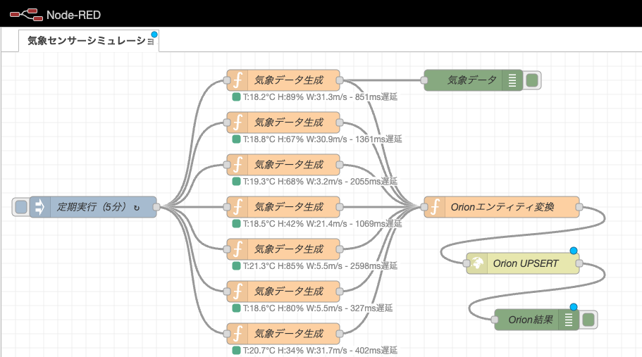

# Fi-Red-Sim

FIWAREデバイスシミュレータ（Node-REDベース）

## 概要

このプロジェクトは、FIWAREエコシステムのためのデバイスシミュレータです。
Node-REDを使用して、様々なIoTデバイスの動作をシミュレートし、FIWARE Orion Context Brokerと連携します。



## 主な機能

- 複数のIoTデバイスのシミュレーション（温度センサー、気象センサー、ビジターカウンター）
- リアルタイムデータ生成（ロジックは適当だけど）
- FIWAREエンティティの自動作成と更新
- NGSIv2形式でのデータモデリング（SmartDataModels準拠のつもり）
- データ項目にメタデータ（概要説明）を追加

## 必要条件

- Docker
- Docker Compose

## セットアップ

1. リポジトリのクローン：
   ```bash
   git clone https://github.com/kzkski/fi-red-sim.git
   cd fi-red-sim
   ```

2. 環境の起動：
   ```bash
   npm start
   # または
   docker-compose up -d
   ```

3. アクセス：
   - Node-RED: http://localhost:1880
   - Orion Context Broker: http://localhost:1026/version

## 使用方法

1. Node-REDインターフェースにアクセス
2. ライブラリから提供されているフローをインポート
   - 温度センサーシミュレーション
   - 気象センサーシミュレーション
   - ビジターカウンターシミュレーション
3. 必要に応じてフローをカスタマイズ
4. デプロイしてシミュレーションを開始

## データの取得

Orion Context Brokerからデータを取得：

```bash
# すべてのエンティティ一覧
curl -X GET http://localhost:1026/v2/entities \
     -H "Fiware-Service: openiot" \
     -H "Fiware-ServicePath: /"

# 特定タイプのエンティティ取得
curl -X GET 'http://localhost:1026/v2/entities?type=WeatherObserved' \
     -H "Fiware-Service: openiot" \
     -H "Fiware-ServicePath: /"

# ビジターカウンターデータの取得
curl -X GET 'http://localhost:1026/v2/entities?type=CrowdFlowObserved' \
     -H "Fiware-Service: openiot" \
     -H "Fiware-ServicePath: /"
```

## ディレクトリ構造

```
fi-red-sim/
├── docker/
│   └── node-red/
│       └── Dockerfile       # Node-RED用Dockerイメージ定義
├── flows/
│   ├── temperature.json     # 温度センサーシミュレーションフロー
│   ├── weather.json         # 気象センサーシミュレーションフロー
│   └── visitor_counter.json # ビジターカウンターシミュレーションフロー
├── docker-compose.yml       # Docker Compose定義
└── package.json             # プロジェクト情報・コマンド
```

## ライセンス

MIT

## 貢献

プルリクエストやイシューの報告を歓迎します。
